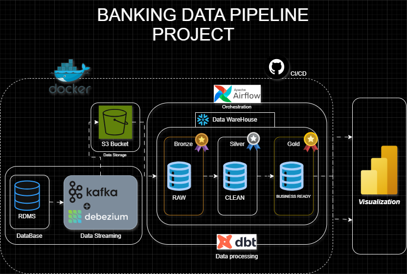

🏦 Real-Time Banking Transactions Pipeline
📌 Overview

This project implements a real-world, end-to-end data engineering pipeline for banking transactions.
It ingests real-time CDC events, persists them as partitioned Parquet files, and transforms them into analytics-ready dimensional models using dbt and Snowflake, orchestrated by Airflow.

The goal is to demonstrate production-style data engineering practices, including streaming ingestion, historical tracking (SCD Type 2), containerization, and orchestration.

🏗️ Architecture

  

🔧 Tech Stack

PostgreSQL – Source banking database

Kafka – Change Data Capture (CDC) streaming

Python – Kafka consumers & Parquet writer

Parquet – Efficient columnar storage

Snowflake – Analytics data warehouse

dbt – Transformations, snapshots, dimensional modeling

Apache Airflow – Orchestration & scheduling

Docker – Containerized environment

📥 Data Ingestion (Streaming Layer)

CDC events are streamed via Kafka topics:

transactions

customers

accounts

Python consumers buffer events in memory

Events are flushed periodically into Parquet files

Files are partitioned by:

entity

year / month / day / hour

Example:

transactions/2026/01/29/16/batch-1769696191.parquet
customers/2026/01/29/16/batch-1769696192.parquet
accounts/2026/01/29/16/batch-1769696192.parquet

This approach avoids small files and optimizes downstream analytics performance.

🔄 Transformation Layer (dbt)
1️⃣ Staging Layer (stg_)

Logical staging layer built in dbt

Standardizes raw Parquet-backed tables

Applies:

naming conventions

type casting

basic data cleaning

Example:

stg_transactions

stg_customers

stg_accounts

2️⃣ Snapshots (SCD Type 2)

dbt snapshots track historical changes

Preserves:

previous values

effective date ranges

Enables time-travel analysis and auditability

Used for:

Customers

Accounts

3️⃣ Dimensional Models

Built on top of snapshots

Optimized for Snowflake analytics

Includes:

Dimension tables (SCD2-aware)

Fact tables for transactions

This follows analytics engineering best practices.

⏱️ Orchestration (Airflow)

Airflow DAGs orchestrate dbt runs:

Snapshots

Dimensional marts

Features:

Retry logic

Containerized execution

Clear task separation

dbt runs inside Docker containers for consistency

🐳 Containerization

All services run as Docker containers

Ensures:

reproducible environments

consistent dependency management

production-like setup

Suitable for local development and CI/CD extension

📊 Current Status

✔ Real-time ingestion implemented
✔ Parquet lake layer working
✔ dbt staging models completed
✔ SCD Type 2 snapshots implemented
✔ Dimensional models in progress
✔ Airflow orchestration configured

🚀 Next Steps

Finalize dbt marts

Add dbt tests & data quality checks

Improve logging & alerting

Add dashboards (optional)

Production hardening

🎯 Why This Project Matters

This project demonstrates:

Real-time data ingestion

Historical correctness (SCD Type 2)

Separation of concerns (ingestion vs transformation)

Modern analytics engineering practices

Debugging real containerized systems

It mirrors enterprise-grade data pipelines, not toy examples.

